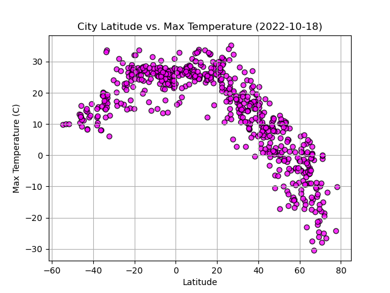
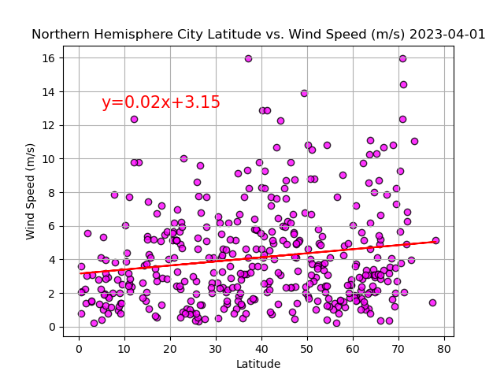

# python-api-challenge

In this challenge we are tasked with the age old question "What is the weather like as we approach the equator?". Seems pretty obvious as far as temperature goes, but what about other aspects such as humidity, cloudiness, and wind speed? 

# WeatherPy
--------------------------------------------------------------------------------------------------------------------------------------------

We will generate a list of cities based on a coordinates range through citipy. With that list we will create a data frame and pull weather data through a weather API to update our data frame. With this data set we will be able to create scatterplots to better show a correlation between weather aspect and its distance from the equator. 

--------------------------------------------------------------------------------------------------------------------------------------------

## Max Temperature Vs Latitude

--------------------------------------------------------------------------------------------------------------------------------------------

## Humidity Percentage Vs Latitude

--------------------------------------------------------------------------------------------------------------------------------------------

## Cloud Coverage Vs Latitude

--------------------------------------------------------------------------------------------------------------------------------------------

## Wind Speed Vs Latitude

--------------------------------------------------------------------------------------------------------------------------------------------

In order to get a better understanding of our data and look for linear relationships, we split our data frame into Northern and Southern Hemispheres. We created new scatterplots and calculated linear regression to look for correlations.

## Northern and Southern Hemisphere Max Temperature Vs Latitude

The linear relationship we find when comparing the northern and southern hemispheres max temperature is just what you would expect. The closer we are to the equator (Latitude = 0) the higher our max temperature will be. 

In the northern hemisphere we have a negative correlation coefficient which is to be expected considering our x-axis (Latitude) is moving further from the equator. We do have a very strong linear relationship between our dependant and independant variables as shown in our R-value of 0.79. 

In the southern hemisphere we have a positive correlation coefficient, but our linear relationship is not as strong as the northern hemisphere with an R-value of 0.45. When we take a closer look at our variables we can see that some of our dependant variables (Max Temperature), despite being so close to the equator, were not that high. This could be a result of what time of year the data was polled at or just a case of the city being in a higher elevation. 

These two data plots overall have very positive linear relationships between the two variables.

--------------------------------------------------------------------------------------------------------------------------------------------

## Northern and Southern Hemisphere Humidity Percentage Vs Latitude

The linear relationship we have when looking at humidity percentages across the southern and northern hemispheres is not as strong as our temperatures. In the northern hemisphere the linear relationship is slightly more positive than the southern hemisphere with an R-value of 0.13. This means we barely have a linear relationship existing. The R-values in both data sets are so close to absolute zero that it is hard to justify that the 2 variables are correlated. 

--------------------------------------------------------------------------------------------------------------------------------------------

## Northern and Southern Hemisphere Cloud Coverage Vs Latitude

The linear relationship we have when looking at cloudiness percentages across the southern and northern hemispheres is also close to no correlation. We still have positive R-values for both northern and southern hemispheres, but being so close to zero and with the observable data in our scatter plots we can justify there is no correlation between our two variables

--------------------------------------------------------------------------------------------------------------------------------------------

## Northern and Southern Hemisphere Wind Speed Vs Latitude

The linear relationship we have when looking at wind speeds across the southern and northern hemispheres is also close to no correlation. We still have positive R-values for both northern and southern hemispheres, but being so close to zero and with the observable data in our scatter plots we can justify there is no correlation between our two variables. The observable data does show that our wind speed is grouped more consistantly the closer it is to the equator. 

--------------------------------------------------------------------------------------------------------------------------------------------

# VacationPy

With this new dataset we collected we will showcase our skills by planning future vacations based on our perfect weather conditions. We filtered the data based on our conditions and plotted a map based on location coordinates, city, conditions, and closest hotel that we found by polling data from an API source. 

